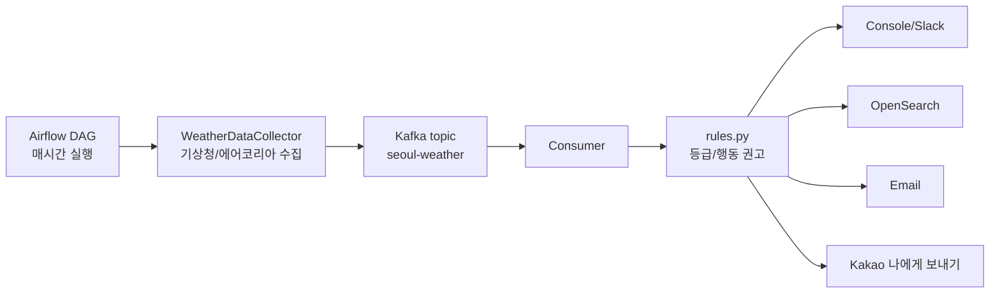
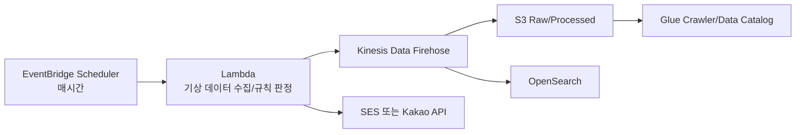
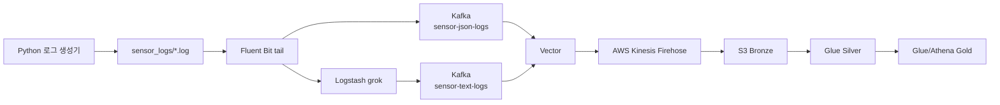

# 서울 기상 알림 시스템

서울 지역의 기상/대기질 데이터를 매 시간 수집해 Kafka에 발행하고, Consumer가 `consumer/rules.py`의 규칙으로 행동 권고를 만든 뒤 OpenSearch, 콘솔, Slack, 이메일, 카카오톡으로 전달하는 로컬 Docker 기반 알림 시스템입니다.

## 기여 / 협업 프로세스

모든 변경은 다음 흐름을 따릅니다: **Issue 등록 → 작업 브랜치 → 작업/검증 → Draft PR → 셀프 리뷰 → Ready for review → 코드 리뷰 → 승인 → Squash merge.** 기본 브랜치(`master`)에 직접 push하지 않습니다.

- 협업 규칙·브랜치 네이밍·커밋 컨벤션: [CONTRIBUTING.md](CONTRIBUTING.md)
- 비밀정보 취급·취약점 제보: [SECURITY.md](SECURITY.md)
- Issue/PR은 `.github`의 템플릿을 사용하며, 리뷰는 CODEOWNERS로 자동 요청됩니다.
- 의존성 취약점은 Dependabot(`.github/dependabot.yml`)이 주간 점검합니다.

## 현재 동작

| 실행 시각(KST) | 알림 기준 | 주요 내용 |
| --- | --- | --- |
| 00시 | 오늘 전체 예보 | 오늘 하루의 대표 위험값, 최저/최고기온, 최대 강수확률 |
| 06시 | 아침 요약 + 현재값 | 오늘 최저/최고기온, 오늘 최대 강수확률, 현재 미세먼지/초미세먼지, 나머지 현재 기준 |
| 12시 | 현재 기준 | 현재 꽃가루, 대기질, 황사, 체감온도, 특보성 신호, 강수확률, 자외선 |
| 18시 | 현재 기준 | 현재 꽃가루, 대기질, 황사, 체감온도, 특보성 신호, 강수확률, 자외선 |

수집 항목은 서울 기준으로 `꽃가루참나무`, `꽃가루소나무`, `미세먼지`, `초미세먼지`, `황사`, `체감온도`, `기타특보`, `강수확률`, `자외선지수`만 사용합니다.

## 구조



Airflow는 데이터를 수집해 Kafka에 발행합니다. Consumer는 Kafka 메시지를 읽어 규칙 기반 판정 결과를 OpenSearch에 저장하고 콘솔/Slack/이메일/카카오톡 알림을 처리합니다.

## 기술 스택

| 구성 | 버전/이미지 | 역할 |
| --- | --- | --- |
| Airflow | `apache/airflow:2.10.0` | 매시간 스케줄링, 데이터 수집, Kafka 발행 |
| Kafka | `apache/kafka:3.7.0` | 기상 데이터 메시지 브로커 |
| Consumer | Python Docker image | 규칙 판정, 알림, OpenSearch 저장 |
| OpenSearch | `opensearchproject/opensearch:2.8.0` | 알림 이력 저장/검색 |
| Kafka UI | `provectuslabs/kafka-ui:latest` | Kafka 토픽 확인 |

의존성 파일에는 소스에서 직접 사용하는 패키지만 명시합니다. Airflow 컨테이너의 추가 패키지와 Consumer 이미지 의존성은 각각 `docker-compose.yaml`, `requirements-consumer.txt`에서 관리합니다.

## 주요 파일

```text
.
├── docker-compose.yaml              # 로컬 실행 환경
├── dags/air_pipeline.py             # Airflow DAG, 데이터 수집 및 Kafka 발행
├── producer/producer.py             # 기상청/에어코리아 API 수집 및 Kafka 발행
├── consumer/rules.py                # 지수별 등급/행동 권고 규칙
├── consumer/consumer.py             # Kafka 소비, 규칙 적용, OpenSearch 저장
├── consumer/alert.py                # 콘솔/Slack/이메일/카카오/OpenSearch 알림
├── glue_jobs/bronze_to_silver.py    # AWS Glue Bronze -> Silver 변환
├── glue_jobs/silver_to_gold_hourly.py # AWS Glue Silver -> Gold 시간별 집계
├── scripts/kakao_get_refresh_token.py
├── requirements.txt
└── requirements-consumer.txt
```

## 환경변수

루트에 `.env` 파일을 두고 아래 값을 채웁니다. 실제 키/토큰은 README에 기록하지 않습니다.

```bash
# 공공데이터 API
WEATHER_API_KEY=your_kma_service_key
AIRKOREA_API_KEY=your_airkorea_service_key

# Kafka / OpenSearch
KAFKA_BOOTSTRAP_SERVERS=kafka:9092
OPENSEARCH_HOST=opensearch
OPENSEARCH_PORT=9200
OPENSEARCH_INDEX_PREFIX=weather-alert

# 이메일 알림
EMAIL_ENABLED=true
ALERT_EMAIL=receiver@example.com
SMTP_HOST=smtp.gmail.com
SMTP_PORT=587
SMTP_USERNAME=your_gmail_address@gmail.com
SMTP_PASSWORD=your_gmail_app_password
SMTP_FROM_EMAIL=your_gmail_address@gmail.com
SMTP_USE_TLS=true
SMTP_USE_SSL=false

# 카카오톡 나에게 보내기
KAKAO_ENABLED=true
KAKAO_REST_API_KEY=your_kakao_rest_api_key
KAKAO_CLIENT_SECRET=your_kakao_client_secret
KAKAO_REFRESH_TOKEN=your_kakao_refresh_token
KAKAO_REDIRECT_URI=http://localhost:8088/kakao/callback

# Slack은 선택
SLACK_ENABLED=false
SLACK_WEBHOOK_URL=
```

Gmail은 계정 비밀번호가 아니라 2단계 인증 후 발급한 앱 비밀번호를 `SMTP_PASSWORD`에 넣어야 합니다.

## 실행

```bash
docker compose up -d --build
docker compose ps
```

접속 주소:

| 서비스 | 주소 | 로그인 |
| --- | --- | --- |
| Airflow | http://localhost:8080 | `airflow` / `airflow` |
| Kafka UI | http://localhost:8081 | 없음 |
| OpenSearch | http://localhost:9200 | 없음 |

Airflow 계정은 컨테이너 시작 시 자동 생성되며, 이미 존재하면 비밀번호를 `airflow`로 재설정합니다.

## DAG 실행

Airflow UI에서 `realtime_weather_alert` DAG를 켜면 매 시간 정각에 실행됩니다. 00시는 오늘 전체 예보, 06시는 아침 요약, 나머지 시간은 현재 기준 알림으로 처리됩니다.

수동 실행:

```bash
docker compose exec airflow airflow dags trigger realtime_weather_alert
```

로그 확인:

```bash
docker compose logs -f airflow
docker compose logs -f consumer
docker compose logs -f kafka
```

## 카카오 refresh token 발급

Kakao Developers 콘솔에서 Redirect URI를 먼저 등록합니다.

```text
http://localhost:8088/kakao/callback
```

그 다음 `.env`에 `KAKAO_REST_API_KEY`와 필요 시 `KAKAO_CLIENT_SECRET`을 넣고 로컬에서 실행합니다.

```bash
python3 scripts/kakao_get_refresh_token.py
```

브라우저에서 카카오 로그인/동의를 마치면 터미널에 `KAKAO_REFRESH_TOKEN`이 출력됩니다. 이 값을 `.env`에 저장하면 Consumer가 Kafka 메시지를 처리할 때마다 refresh token으로 access token을 새로 받아 카카오톡 나에게 보내기를 수행합니다.

## 알림 내용

메일과 카카오톡은 원본 API 값을 그대로 던지지 않고, `consumer/rules.py`의 판정 규칙을 거쳐 행동 중심 메시지로 보냅니다.

Consumer는 등급이 직전과 바뀔 때만 외부 채널(Slack/이메일/카카오톡)로 발송합니다. 매 실행 시각(00/06/12/18시)마다 판정은 하지만, 각 지수의 등급 조합(수치가 아니라 좋음/보통/나쁨/매우나쁨)이 직전과 같으면 외부 발송을 생략해 같은 상태의 반복 알림을 막습니다. 직전 등급은 재시작에도 남도록 OpenSearch에서 읽고, 콘솔 출력과 OpenSearch 이력 저장은 등급 무변경일 때도 항상 유지합니다. OpenSearch 조회에 실패하면 알림 유실을 막기 위해 발송하는 쪽으로 동작합니다.

예시:

```text
[서울 오늘 아침 기상 알림] 06:00

행동
- 마스크 착용
- 우산 준비

위험/주의
- 미세먼지 82㎍/㎥: 나쁨
- 강수확률 70%: 나쁨

나머지
기온 최저 12℃, 최고 20℃
미세먼지 나쁨, 초미세먼지 보통
황사 보통, 강수확률 70%, 자외선 4
특보 없음
```

## 데이터 기준

| 항목 | 출처/처리 |
| --- | --- |
| 꽃가루참나무/소나무 | 기상청 보건기상지수 |
| 미세먼지/초미세먼지 | 에어코리아 시도별 실시간 측정 평균 |
| 황사 | 에어코리아 황사 발생정보, 권한이 없으면 PM10 기반 대체 |
| 체감온도 | 생활기상지수 또는 단기예보 온도 대체 |
| 기타특보 | 단기예보의 낙뢰/강풍/강수/하늘 상태 신호 기반 |
| 강수확률 | 00시/06시는 오늘 최대값, 12시/18시는 현재 가까운 예보 |
| 자외선지수 | 기상청 UV API의 시간별 `h*` 값 중 현재 시각 이하의 가장 최근 값 |

## 검증 명령

문법 확인:

```bash
python3 -m compileall producer consumer dags scripts
```

단위 테스트(순수 판정 로직):

```bash
pip install pytest
pytest -q
```

`master`로 향하는 PR·push는 GitHub Actions(`.github/workflows/ci.yml`)가 위 compile + pytest를 자동 실행하며, 통과가 머지 필수 조건이다.

컨테이너 안에서 DAG import 확인:

```bash
docker compose exec airflow python -m py_compile /opt/airflow/dags/air_pipeline.py
```

06시 알림 데이터 생성 확인:

```bash
docker compose exec airflow python -c "from producer.producer import WeatherDataCollector; c=WeatherDataCollector(); print(c.collect_scheduled_weather('서울', run_hour=6)); c.close()"
```

Kafka 토픽 확인:

```bash
docker compose exec kafka /opt/kafka/bin/kafka-topics.sh --bootstrap-server kafka:9092 --list
```

OpenSearch 인덱스 확인:

```bash
curl http://localhost:9200/_cat/indices?v
```

## 문제 해결

### Airflow 로그인이 안 될 때

현재 기본 계정은 `airflow` / `airflow`입니다. 그래도 안 되면 계정을 직접 재설정합니다.

```bash
docker compose exec airflow airflow users reset-password --username airflow --password airflow
```

### Gmail SMTP 535 오류

`SMTP_USERNAME`은 전체 Gmail 주소여야 하고, `SMTP_PASSWORD`는 일반 비밀번호가 아니라 Gmail 앱 비밀번호여야 합니다. Gmail 계정의 2단계 인증을 켠 뒤 앱 비밀번호를 새로 발급해 넣습니다.

### 카카오톡 발송 실패

`KAKAO_REFRESH_TOKEN`이 없거나 만료되면 `scripts/kakao_get_refresh_token.py`를 다시 실행합니다. Kakao Developers 콘솔의 Redirect URI가 `.env`의 `KAKAO_REDIRECT_URI`와 정확히 같아야 합니다.

### 자외선지수가 포털 검색값과 다를 때

이 프로젝트는 기상청 UV API의 시간별 값 중 현재 시각 이하의 가장 최근 발표값을 사용합니다. 포털은 관측소, 발표 지연, 보정 모델이 다를 수 있어 일시적으로 차이가 날 수 있습니다.

### 에어코리아 황사 권한 오류

황사 발생정보 API 활용 신청 권한이 없으면 PM10 값을 황사 대체값으로 사용합니다. 실제 황사 발생정보가 필요하면 공공데이터포털에서 해당 에어코리아 API 활용 권한을 신청해야 합니다.

### Airflow LocalExecutor/SQLite 오류

로컬 compose는 SQLite와 호환되는 `SequentialExecutor`를 사용합니다. `LocalExecutor`로 바꾸려면 Airflow 메타DB를 PostgreSQL 등으로 교체해야 합니다.

## AWS 이전 방향

로컬 Docker 구성을 AWS로 옮길 때는 다음 흐름이 가장 자연스럽습니다.



Airflow가 꼭 필요하지 않다면 EventBridge Scheduler + Lambda로 단순화할 수 있습니다. DAG가 더 복잡해질 예정이면 MWAA 또는 ECS/Fargate에서 Airflow를 운영하는 방식이 맞습니다.

## 센서 로그 메달리언 파이프라인

기상 알림 파이프라인과 별도로, 로컬 Kafka를 재사용하는 센서 로그 수집/메달리언 예제 파이프라인이 포함되어 있습니다.



로컬에서 먼저 Kafka까지 확인합니다.

```bash
docker compose up -d kafka kafka-ui log-generator logstash fluent-bit
docker compose logs -f log-generator
docker compose logs -f fluent-bit
docker compose logs -f logstash
```

Kafka UI에서 아래 토픽을 확인합니다.

```text
sensor-json-logs
sensor-text-logs
```

토픽 CLI 확인:

```bash
docker compose exec kafka /opt/kafka/bin/kafka-topics.sh --bootstrap-server kafka:9092 --list
```

메시지 확인:

```bash
docker compose exec kafka /opt/kafka/bin/kafka-console-consumer.sh --bootstrap-server kafka:9092 --topic sensor-json-logs --from-beginning --max-messages 5
docker compose exec kafka /opt/kafka/bin/kafka-console-consumer.sh --bootstrap-server kafka:9092 --topic sensor-text-logs --from-beginning --max-messages 5
```

AWS Firehose로 보내려면 `.env`에 아래 값을 추가하고 `aws` profile로 Vector를 실행합니다.

```bash
AWS_ACCESS_KEY_ID=your_access_key
AWS_SECRET_ACCESS_KEY=your_secret_key
AWS_REGION=ap-northeast-2
FIREHOSE_STREAM_NAME=sensor-log-bronze-firehose
```

```bash
docker compose --profile aws up -d vector
docker compose logs -f vector
```

권장 S3 메달리언 경로:

```text
s3://your-bucket/sensor-logs/bronze/
s3://your-bucket/sensor-logs/silver/
s3://your-bucket/sensor-logs/gold/hourly_summary/
```

Bronze는 Firehose가 받은 원본 JSON/Text 파싱 결과를 보존합니다. Silver는 Glue PySpark Job으로 `event_time`, `sensor_id`, `source_type`, `log_level`, `metric_name`, `metric_value`, `unit`, `status`, `message` 스키마로 정제하고 Parquet으로 저장합니다. Gold는 Silver를 센서/지표/시간 단위로 집계해 Athena, QuickSight, OpenSearch에서 바로 쓰는 분석 테이블로 만듭니다.

Glue Job 스크립트:

```text
glue_jobs/bronze_to_silver.py
glue_jobs/silver_to_gold_hourly.py
```

Glue Job 파라미터 예시:

```bash
# Bronze -> Silver
--BRONZE_PATH=s3://your-bucket/sensor-logs/bronze/
--SILVER_PATH=s3://your-bucket/sensor-logs/silver/

# Silver -> Gold
--SILVER_PATH=s3://your-bucket/sensor-logs/silver/
--GOLD_PATH=s3://your-bucket/sensor-logs/gold/hourly_summary/
```
