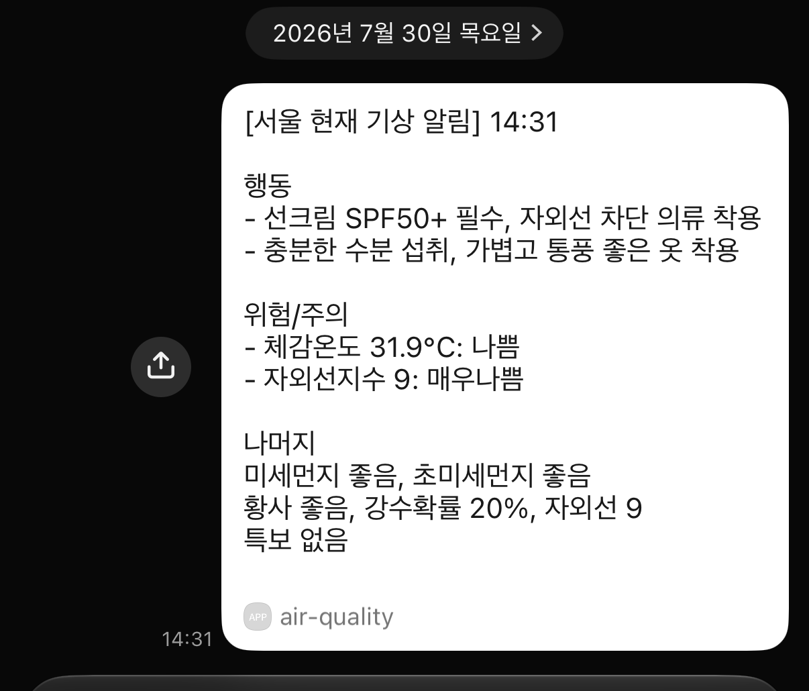
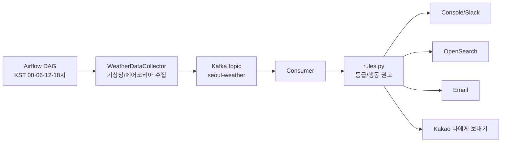

# 서울 기상 알림 시스템

[](https://github.com/hyeongyu-data/air-quality-project/actions/workflows/ci.yml)

기상청·에어코리아 공공 API에서 기상·대기질 지수 9종을 하루 4번(KST 00·06·12·18시) 수집하고, 공인 임계값으로 등급을 판정해 카카오톡·이메일·Slack으로 **행동 권고**를 보내는 이벤트 파이프라인입니다. 전 구성이 로컬 Docker Compose로 재현·검증됩니다.

**Python · Airflow · Kafka · OpenSearch** — 하루 4건 워크로드에 이 스택이 과잉이라는 것을 알고 선택했습니다. 근거와 재검토 조건은 [ADR](docs/adr/)에 있습니다.

## 결과

2026-07-30 실제 수신 화면 — 실데이터(체감온도 31.9℃ 나쁨, 자외선 9 매우나쁨) 기준 행동 권고입니다.



실측 수치 (로컬 Docker, [재측정 쿼리](docs/observability.md#실측-수치-2026-07-30-로컬-docker)):

| 항목 | 값 |
| --- | --- |
| end-to-end 지연 (발행 → 처리 완료) | 4.4~16초 — 폴링 간격(10초)이 지배 |
| 메시지 처리 소요 (판정+색인+발송) | 100~300 ms |
| 회귀 테스트 | 195개 (시작 시점 18개) |
| CI 게이트 | compile · pytest · 커버리지 바닥 · ruff · pip-audit · gitleaks · hadolint |

## 데이터가 흐르는 모습 (실물)

위 스크린샷과 같은 실행에서 나온 실제 데이터입니다.

**1. Kafka 메시지** (`seoul-weather`) — Airflow DAG가 수집·발행:

```json
{
  "schema_version": 1,
  "event_id": "서울:2026073012",
  "timestamp": "2026-07-30T14:31:18.809997+09:00",
  "region": "서울",
  "pm10": 19.6, "pm25": 11.9, "yellow_dust": 0.0,
  "feels_like_temp": 31.9, "uv_index": 9.0,
  "precipitation_probability": 20.0, "other_special_notice": "없음",
  "oak_pollen": null, "pine_pollen": null
}
```

**2. OpenSearch 판정 문서** (`weather-alert-2026.07`, `_id = event_id`) — Consumer가 판정·저장:

```json
{
  "event_id": "서울:2026073012",
  "alert_severity": "MEDIUM",
  "delivered_channels": ["kakao"],
  "levels": {
    "pm10_level": "좋음",
    "feels_like_temp_level": "나쁨",
    "uv_index_level": "매우나쁨",
    "oak_pollen_level": "정보없음"
  }
}
```

**3. 알림** — 위 스크린샷. `null`(꽃가루, 계절 미발표)이 `0`이나 "좋음"이 아니라 **정보없음**으로 흐르는 것이 이 파이프라인의 핵심 계약입니다.

## 구조



| 구성 | 버전/이미지 | 역할 |
| --- | --- | --- |
| Airflow | `apache/airflow:2.10.0` | 6시간 주기 스케줄링, 수집, 계약 검증, Kafka 발행 |
| Kafka | `apache/kafka:3.7.0` | 버퍼·백로그 재생 (영속 볼륨, 보존 72h) |
| Consumer | Python Docker image | 규칙 판정, 멀티채널 발송, 메트릭 |
| OpenSearch | `opensearchproject/opensearch:2.8.0` | 판정 이력·쿨다운 상태·처리 메트릭 |
| Kafka UI / OpenSearch Dashboards | `v0.7.2` / `2.8.0` | 토픽 점검 / 운영 관측(`--profile ops`) |

## 현재 동작

| 실행 시각(KST) | 알림 기준 | 주요 내용 |
| --- | --- | --- |
| 00시 | 오늘 전체 예보 | 오늘 하루의 대표 위험값, 최저/최고기온, 최대 강수확률 |
| 06시 | 아침 요약 + 현재값 | 오늘 최저/최고기온, 최대 강수확률, 현재 미세먼지, 나머지 현재 기준 |
| 12시 | 현재 기준 | 현재 꽃가루, 대기질, 황사, 체감온도, 특보성 신호, 강수확률, 자외선 |
| 18시 | 현재 기준 | 현재 꽃가루, 대기질, 황사, 체감온도, 특보성 신호, 강수확률, 자외선 |

이 네 시각은 cron(`0 */6 * * *`)·판정 분기·이 표가 어긋나지 않도록 테스트로 묶여 있습니다(`tests/test_schedule.py`).

## 왜 이 스택인가

규모 주장을 하지 않습니다. 각 결정은 정직한 전제 → 실제 근거 → **재검토 조건** 구조로 기록돼 있습니다.

| 선택 | 한 줄 요약 | 기록 |
| --- | --- | --- |
| Kafka | 규모(하루 4건)가 아니라 장애 격리·백로그 재생이 근거. 실배포 시 SQS 교체 | [ADR-0002](docs/adr/0002-why-kafka.md) |
| OpenSearch | 이력 탐색과 공유 상태 저장의 겸용. 대시보드 요구가 없으면 SQLite 강등이 옳다 | [ADR-0003](docs/adr/0003-why-opensearch.md) |
| 규칙 엔진 | 임계값이 환경부·기상청 공인 기준 — 가치는 예측이 아니라 정확한 반영 | [ADR-0004](docs/adr/0004-why-rule-engine.md) |
| 로컬 Docker | 비용이 아니라 검증 가능성의 선택. 검증 불가한 AWS 코드는 삭제했다 | [ADR-0001](docs/adr/0001-remove-sensor-log-medallion.md) · [0005](docs/adr/0005-aws-migration-path.md) |

## 데이터 계약

Kafka 메시지의 필드 계약입니다. 발신(`producer/contract.py`)과 수신(`consumer/schema.py`)의 `SCHEMA_VERSION`이 짝이며, 위반 메시지는 DLQ로 격리됩니다.

| 필드 | 타입 | 결측 시 | 출처 |
| --- | --- | --- | --- |
| `event_id` | keyword (`지역:YYYYMMDDHH`) | **필수** — 없으면 DLQ | DAG (스케줄 슬롯 기반) |
| `schema_version` | int | 레거시 허용, 불일치는 DLQ | DAG |
| `timestamp` | ISO8601(+09:00) | **필수** | 수집기 |
| `region` | keyword | **필수** | 수집기 |
| `pm10` `pm25` | float ㎍/㎥ | `null` → 정보없음 | 에어코리아 (측정소 평균) |
| `yellow_dust` | float | `null` → 정보없음 (프록시 대체 안 함) | 에어코리아 발생정보 |
| `feels_like_temp` | float ℃ | `null` → 정보없음 | 생활지수 → 초단기실황 폴백 |
| `oak_pollen` `pine_pollen` | float | `null` → 정보없음 (계절 지수) | 기상청 보건지수 |
| `precipitation_probability` | float % | `null` → 정보없음 | 단기예보 |
| `uv_index` | float | `null` → 정보없음 | 기상청 UV (h* 오프셋 환산) |
| `other_special_notice` | str | `"정보없음"` ≠ `"없음"`(확인된 정상) | 초단기예보 신호 |
| `data_warnings` | object | — | 수집 실패 사유 (본문 "참고"로 노출) |

## 빠른 시작

```bash
cp .env.example .env   # 없으면 docs/RUNBOOK.md의 환경변수 절 참고
docker compose up -d --build
# Airflow http://localhost:8080 에서 realtime_weather_alert DAG를 켠다
```

실행·검증·트러블슈팅 절차 전체: **[docs/RUNBOOK.md](docs/RUNBOOK.md)** · 운영 보안 프로필: [SECURITY.md](SECURITY.md)

## 운영 설계

아래 각 절은 실제 장애를 일으켜 검증한 항목입니다. 결함 발견 → 수정의 전체 서사는 [트러블슈팅 기록](docs/troubleshooting.md)과 [운영 리스크 문서](docs/operational-risks.md)에 있습니다.

### 알림 내용

메일과 카카오톡은 원본 API 값을 그대로 던지지 않고, `consumer/rules.py`의 판정 규칙을 거쳐 행동 중심 메시지로 보냅니다.

수집에 실패한 지수는 0으로 채우지 않고 `정보없음` 등급으로 그대로 표시합니다. 결측을 0으로 바꾸면 체감온도 결측이 "동상 위험"이 되거나 미세먼지 결측이 "외출 자유"가 되기 때문입니다. 결측 지수는 행동 권고를 활성화하지 않으며, 미세먼지와 초미세먼지가 모두 결측이면 판정 근거가 없다고 보고 외부 채널 발송을 보류합니다(콘솔 출력과 OpenSearch 이력은 유지).

Consumer는 등급이 직전과 바뀔 때만 외부 채널(Slack/이메일/카카오톡)로 발송합니다. 다만 등급이 같아도 마지막 외부 발송에서 `MAX_SILENCE_HOURS`(기본 12시간)가 지나면 한 번 재발송합니다 — 조용한 것이 정상(쿨다운)인지 고장(파이프라인 정지)인지 사용자가 구분할 수 있게 하는 최소 장치입니다. `0`이면 끕니다.

직전 등급과 마지막 발송 시각은 지역별 상태 문서(`weather-cooldown-state` 인덱스, 문서 ID = 지역)로 관리합니다. 문서 GET은 refresh와 무관하게 실시간이라, 이력 인덱스를 검색하던 방식의 지연 레이스가 없습니다. 이 인덱스는 `weather-alert-*` 패턴 밖이라 90일 보존 정책의 삭제 대상이 아닙니다. 등급 무변경 시에도 콘솔 출력과 OpenSearch 이력 저장은 항상 유지하며, 상태 조회에 실패하면 알림 유실을 막기 위해 발송하는 쪽(fail-open)으로 동작합니다.

쿨다운 기준이 되는 등급 시그니처는 **외부 채널에 실제로 전달됐을 때만** 기록합니다. SMTP 인증 만료나 카카오 토큰 만료로 활성 채널이 전부 실패하면 시그니처를 비워 저장해 다음 회차에 같은 등급이어도 재발송합니다. 그러지 않으면 발송이 실패한 순간의 등급이 굳어 등급이 유지되는 동안 알림이 영구히 사라집니다.

예시:

```text
[서울 오늘 아침 기상 알림] 06:00

행동
- 마스크 착용
- 우산 준비

위험/주의
- 미세먼지 82㎍/㎥: 나쁨
- 강수확률 70%: 나쁨

나머지
기온 최저 12℃, 최고 20℃
미세먼지 나쁨, 초미세먼지 보통
황사 보통, 강수확률 70%, 자외선 4
특보 없음
```

### 데이터 기준

| 항목 | 출처/처리 |
| --- | --- |
| 꽃가루참나무/소나무 | 기상청 보건기상지수 |
| 미세먼지/초미세먼지 | 에어코리아 시도별 실시간 측정 평균 |
| 황사 | 에어코리아 황사 발생정보. 권한이 없으면 `정보없음`(대체값을 만들지 않음) |
| 체감온도 | 생활기상지수 또는 단기예보 온도 대체 |
| 기타특보 | 단기예보의 낙뢰/강풍/강수/하늘 상태 신호 기반 |
| 강수확률 | 00시/06시는 오늘 최대값, 12시/18시는 현재 가까운 예보 |
| 자외선지수 | 기상청 UV API의 시간별 `h*` 값 중 현재 시각 이하의 가장 최근 값 |

### Consumer 수명 관리

Consumer는 무한 루프 + 시그널 종료로 동작합니다. `SIGTERM`/`SIGINT`를 받으면 1초 안에 루프를 빠져나와 Kafka 연결을 정리하고 종료 코드 0으로 끝납니다. 재시작 정책은 `on-failure`라 크래시만 재시작되고, `docker stop`은 멈춘 상태로 남습니다.

생존 판정은 하트비트 파일(`CONSUMER_HEARTBEAT_PATH`, 기본 `/tmp/consumer-heartbeat`)로 합니다. 루프가 매 사이클 파일을 touch하고, compose healthcheck가 파일 나이 90초를 기준으로 봅니다 — 프로세스는 떠 있는데 루프가 멈춘 상태(행)를 잡습니다.

Kafka·OpenSearch 연결은 지수 백오프(5초 → 최대 300초)로 재시도하므로 기동 순서나 일시 장애에 영향받지 않습니다. 처리량 상한은 `max_poll_records=10` + 10초 폴링 = 초당 약 1건이며, 하루 4건 워크로드 기준입니다.

### OpenSearch 구성

컨슈머가 연결에 성공하면 인덱스 템플릿과 보존 정책을 적용합니다(`consumer/opensearch_setup.py`). `PUT`은 멱등하므로 매 기동마다 호출해도 안전하고, 별도 관리 스크립트를 두지 않아 "적용을 잊는" 경로가 없습니다.

| 항목 | 값 | 이유 |
| --- | --- | --- |
| 인덱스 단위 | 월 (`weather-alert-2026.07`) | 일 단위면 1년에 365개 인덱스가 쌓입니다. 조회는 와일드카드라 그대로 동작합니다 |
| `number_of_replicas` | 0 | 단일 노드에서 replica 1은 영구 미할당이라 클러스터가 상시 yellow가 됩니다 |
| `region`·`event_id`·`grade_signature` | `keyword` | `text`면 분석기를 타서 정확 일치 조회가 오매칭합니다 |
| `indices.*` 수치 | `float` | 동적 매핑이면 첫 문서가 정수일 때 `long`이 잡혀 45.6이 45로 절삭됩니다 |
| 보존 | 90일 (ISM) | 월 단위 인덱스라 30일로 두면 사용 중인 이번 달 인덱스를 지웁니다 |

healthcheck는 `wait_for_status=yellow`를 씁니다. 상태를 확인하지 않으면 red 클러스터도 200을 돌려줘 healthy로 통과합니다. 데이터 인덱스는 green이며, 남는 yellow는 ISM 플러그인의 시스템 인덱스(`.opendistro-ism-config`) replica로 단일 노드에서는 정상입니다.

OpenSearch가 죽어 있어도 쿨다운은 유지됩니다. 마지막으로 알린 등급을 `SIGNATURE_STATE_PATH`(기본 `.signature_state.json`)에 남기고, 조회가 실패하면 이 캐시를 씁니다. 캐시가 없으면 이전처럼 발송하는 쪽(fail-open)으로 동작합니다.

### 데이터 영속성

Kafka 토픽 로그·KRaft 메타데이터·컨슈머 오프셋은 명명 볼륨 `kafka_data`에 저장됩니다. 이미지 기본값은 컨테이너 쓰기 레이어(`/tmp/kafka-logs`)라 컨테이너를 재생성하면 토픽과 오프셋이 사라집니다.

```bash
docker compose down          # 볼륨은 유지된다 (-v를 붙이면 삭제)
docker compose up -d kafka
docker exec pj-kafka /opt/kafka/bin/kafka-consumer-groups.sh \
  --bootstrap-server kafka:9092 --group weather-alert-group --describe
```

재생성 후에도 `CURRENT-OFFSET`이 유지되면 정상입니다. 컨슈머는 `auto_offset_reset=earliest`라 죽어 있던 동안 쌓인 메시지를 건너뛰지 않고, 중복은 등급 시그니처 쿨다운과 `event_id` upsert가 흡수합니다. 보존기간은 72시간입니다.

### 시간대

모든 시각은 코드에서 **KST를 명시**해 만듭니다(`producer/timeutil.py`, `consumer/timeutil.py`). 컨테이너 `TZ` 설정에 의존하지 않습니다.

- 발행 타임스탬프는 오프셋을 포함한 ISO8601(`2026-07-29T12:00:00+09:00`)입니다. 오프셋이 없으면 OpenSearch가 UTC로 해석해 이력이 9시간 밀립니다.
- 기상청 API의 발표시각(`base_time`)도 KST aware로 변환해 비교합니다.
- 두 `timeutil.py`는 같은 내용입니다. Consumer 이미지는 `consumer/`만 포함하므로 producer 쪽을 import 할 수 없습니다. 한쪽을 고치면 다른 쪽도 함께 고칩니다.

### 관측성

처리 메트릭(전달 여부·지연·결측)은 메시지당 1건씩 `weather-metrics-*` 인덱스에 남고, Consumer 로그는 `LOG_FORMAT=json`으로 구조화되며 처리 중 모든 로그에 `event_id`가 붙습니다. 메트릭 사전·알람 기준 8종·실측 수치는 [docs/observability.md](docs/observability.md)에 있습니다.

### 전달 보장

오프셋은 **처리(판정·저장·발송 시도)가 끝난 뒤에만 커밋**합니다(at-least-once). 자동 커밋은 처리 실패 메시지를 조용히 유실했습니다. 재처리로 생기는 중복은 `event_id` upsert와 등급 시그니처 쿨다운이 흡수합니다.

처리할 수 없는 메시지(깨진 JSON, 지원하지 않는 `schema_version`, 필수 키 누락, 처리 예외)는 **DLQ 토픽**(`KAFKA_DLQ_TOPIC`, 기본 `seoul-weather-dlq`)으로 격리한 뒤 오프셋을 전진시킵니다 — poison pill이 소비를 막지 않습니다. DLQ 발행조차 실패하면 커밋을 보류해 배치를 재처리합니다.

```bash
# 격리된 메시지와 사유 확인
docker compose exec kafka /opt/kafka/bin/kafka-console-consumer.sh \
  --bootstrap-server kafka:9092 --topic seoul-weather-dlq --from-beginning
```

메시지 계약은 `producer/contract.py`(발신)와 `consumer/schema.py`(수신)의 `SCHEMA_VERSION`으로 잇습니다. 두 상수가 같은지 테스트가 고정하며, 토픽명은 양쪽이 같은 환경변수(`KAFKA_TOPIC`)를 읽습니다.

### 멱등성

각 수집 이벤트에는 **예정된 실행 시각 기준**의 결정적 키 `event_id`가 붙습니다(`지역:YYYYMMDDHH`, KST). 벽시계가 아니라 스케줄 슬롯에서 만들기 때문에 태스크가 재시도돼도 값이 같습니다.

| 지점 | 중복 방지 |
| --- | --- |
| Kafka 발행 | `enable_idempotence=True` + `acks=all` — 프로듀서 재시도를 브로커가 걸러냄 |
| OpenSearch 색인 | `_id = event_id` — 같은 이벤트를 재처리하면 문서를 덮어씀 |

확인 방법 — 같은 시각의 DAG를 여러 번 트리거한 뒤 문서 수가 1건인지 봅니다.

```bash
curl -s "http://localhost:9200/weather-alert-*/_search?q=event_id:%22서울:2026072912%22" | grep -o '"total":{"value":[0-9]*'
```

### 실패 처리

DAG는 다음 경우에 태스크를 실패시킵니다. 실패는 `on_failure_callback`으로 Slack에 통보되며(`SLACK_ENABLED=true`이고 웹훅이 설정된 경우), `retries: 2`가 그때 실제로 동작합니다.

| 상황 | 동작 |
| --- | --- |
| 수집된 지수가 하나도 없음 | `fetch_current_weather` 실패 — 발행해도 알릴 내용이 없다 |
| 일부 지수만 결측 | 발행 진행 + 경고 로그. 결측은 컨슈머가 `정보없음`으로 처리한다 |
| Kafka 발행 0건 | `publish_to_kafka` 실패 — 알림이 나가지 않았다는 뜻이다 |

## 알려진 한계와 다음 단계

숨기는 것보다 적어두는 쪽이 낫습니다.

- **처리량 상한 초당 ~1건** — 폴링 기반 소비(10초 간격). 하루 4건 설계라 의도된 상한이며, 늘리려면 폴링 간격부터 줄인다.
- **producer 네트워크 계층 커버리지 30%대** — 파싱은 픽스처 계약 테스트로 덮었지만 HTTP 재시도 경로는 미테스트.
- **운영 프로필의 남은 숙제** — OpenSearch가 데모 인증서·내장 admin을 쓰고, Kafka는 compose 내부 PLAINTEXT다. 실배포 전 필수 처리 목록이 [SECURITY.md](SECURITY.md)에 있다.
- **알람은 기준까지만** — 판정 쿼리 8종은 정의됐지만([observability.md](docs/observability.md)) 자동 발송 배선은 안 했다. 로컬 환경에선 울릴 곳이 없다.
- **단일 지역** — 서울 고정. 지역 확장 시 파티션 키 설계는 준비돼 있다(지역 기반).

## 문서

| 문서 | 내용 |
| --- | --- |
| [프로젝트 소개 대시보드](docs/dashboard.html) | 파이프라인·설계 하이라이트·지표 한 화면 |
| [ADR 5편](docs/adr/) | 기술 선택의 근거와 재검토 조건 |
| [트러블슈팅 기록](docs/troubleshooting.md) | 가설→검증→원인→재발 방지 서사 3건 |
| [운영 리스크](docs/operational-risks.md) | 장애 시나리오 전수 (파일:라인 근거) |
| [관측성](docs/observability.md) | 메트릭 사전·알람 기준·실측 수치 |
| [실행 가이드](docs/RUNBOOK.md) | 환경변수·실행·검증·문제 해결 |
| [CONTRIBUTING](CONTRIBUTING.md) · [SECURITY](SECURITY.md) | 협업 규칙 · 보안 원칙과 운영 프로필 |

## 기여 / 협업 프로세스

모든 변경은 **Issue → 브랜치 → PR → CI(7종 게이트) → 셀프 리뷰 → Squash merge** 흐름을 따르며, `master` 직접 push는 브랜치 보호로 차단돼 있습니다. 의존성은 Dependabot이 주간 점검하고 7일 SLA로 처리합니다.

## AWS 이전 방향

현재 구성이 로컬 Docker인 것은 **검증 가능성의 선택**입니다 — 이 저장소의 모든 코드는 `docker compose up`으로 재현·검증 가능해야 한다는 원칙을 지킵니다. AWS 이전의 구체적 형태(EventBridge + Lambda + SQS + DynamoDB), 구성 요소별 대응 근거, 이전 시 밟아야 하는 지뢰(타임존·멱등성·IaC)와 실행 트리거는 [ADR-0005](docs/adr/0005-aws-migration-path.md)에 기록돼 있습니다.
