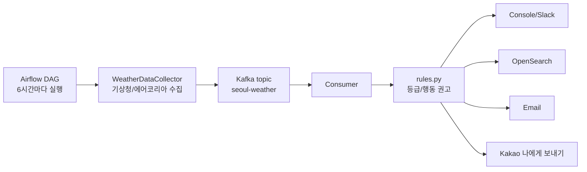

# 서울 기상 알림 시스템

서울 지역의 기상/대기질 데이터를 하루 네 번(00·06·12·18시) 수집해 Kafka에 발행하고, Consumer가 `consumer/rules.py`의 규칙으로 행동 권고를 만든 뒤 OpenSearch, 콘솔, Slack, 이메일, 카카오톡으로 전달하는 로컬 Docker 기반 알림 시스템입니다.

## 프로젝트 현황

- 프로젝트 소개 대시보드(아키텍처·설계 하이라이트·기술 선택 근거): [docs/dashboard.html](docs/dashboard.html)
- 운영 리스크와 개선 방안(코드 근거 포함): [docs/operational-risks.md](docs/operational-risks.md)
- 아키텍처 결정 기록: [docs/adr/](docs/adr/) — 메달리언 제거(0001) · 왜 Kafka인가(0002) · 왜 OpenSearch인가(0003) · 왜 규칙 엔진인가(0004) · AWS 이전 경로(0005)

## 기여 / 협업 프로세스

모든 변경은 다음 흐름을 따릅니다: **Issue 등록 → 작업 브랜치 → 작업/검증 → Draft PR → 셀프 리뷰 → Ready for review → 코드 리뷰 → 승인 → Squash merge.** 기본 브랜치(`master`)에 직접 push하지 않습니다.

- 협업 규칙·브랜치 네이밍·커밋 컨벤션: [CONTRIBUTING.md](CONTRIBUTING.md)
- 비밀정보 취급·취약점 제보: [SECURITY.md](SECURITY.md)
- Issue/PR은 `.github`의 템플릿을 사용하며, 리뷰는 CODEOWNERS로 자동 요청됩니다.
- 의존성 취약점은 Dependabot(`.github/dependabot.yml`)이 주간 점검합니다.

## 현재 동작

| 실행 시각(KST) | 알림 기준 | 주요 내용 |
| --- | --- | --- |
| 00시 | 오늘 전체 예보 | 오늘 하루의 대표 위험값, 최저/최고기온, 최대 강수확률 |
| 06시 | 아침 요약 + 현재값 | 오늘 최저/최고기온, 오늘 최대 강수확률, 현재 미세먼지/초미세먼지, 나머지 현재 기준 |
| 12시 | 현재 기준 | 현재 꽃가루, 대기질, 황사, 체감온도, 특보성 신호, 강수확률, 자외선 |
| 18시 | 현재 기준 | 현재 꽃가루, 대기질, 황사, 체감온도, 특보성 신호, 강수확률, 자외선 |

수집 항목은 서울 기준으로 `꽃가루참나무`, `꽃가루소나무`, `미세먼지`, `초미세먼지`, `황사`, `체감온도`, `기타특보`, `강수확률`, `자외선지수`만 사용합니다.

## 구조



Airflow는 데이터를 수집해 Kafka에 발행합니다. Consumer는 Kafka 메시지를 읽어 규칙 기반 판정 결과를 OpenSearch에 저장하고 콘솔/Slack/이메일/카카오톡 알림을 처리합니다.

## 기술 스택

| 구성 | 버전/이미지 | 역할 |
| --- | --- | --- |
| Airflow | `apache/airflow:2.10.0` | 6시간 주기 스케줄링, 데이터 수집, Kafka 발행 |
| Kafka | `apache/kafka:3.7.0` | 기상 데이터 메시지 브로커 |
| Consumer | Python Docker image | 규칙 판정, 알림, OpenSearch 저장 |
| OpenSearch | `opensearchproject/opensearch:2.8.0` | 알림 이력 저장/검색 |
| Kafka UI | `provectuslabs/kafka-ui:latest` | Kafka 토픽 확인 |

의존성 파일에는 소스에서 직접 사용하는 패키지만 명시합니다. Airflow 컨테이너의 추가 패키지와 Consumer 이미지 의존성은 각각 `docker-compose.yaml`, `requirements-consumer.txt`에서 관리합니다.

## 주요 파일

```text
.
├── docker-compose.yaml              # 로컬 실행 환경
├── dags/air_pipeline.py             # Airflow DAG, 데이터 수집 및 Kafka 발행
├── producer/producer.py             # 기상청/에어코리아 API 수집 및 Kafka 발행
├── consumer/rules.py                # 지수별 등급/행동 권고 규칙
├── consumer/consumer.py             # Kafka 소비, 규칙 적용, OpenSearch 저장
├── consumer/alert.py                # 콘솔/Slack/이메일/카카오/OpenSearch 알림
├── scripts/kakao_get_refresh_token.py
├── requirements.txt
└── requirements-consumer.txt
```

## 환경변수

루트에 `.env` 파일을 두고 아래 값을 채웁니다. 실제 키/토큰은 README에 기록하지 않습니다.

```bash
# 공공데이터 API
WEATHER_API_KEY=your_kma_service_key
AIRKOREA_API_KEY=your_airkorea_service_key

# Kafka / OpenSearch
KAFKA_BOOTSTRAP_SERVERS=kafka:9092
OPENSEARCH_HOST=opensearch
OPENSEARCH_PORT=9200
OPENSEARCH_INDEX_PREFIX=weather-alert

# 이메일 알림
EMAIL_ENABLED=true
ALERT_EMAIL=receiver@example.com
SMTP_HOST=smtp.gmail.com
SMTP_PORT=587
SMTP_USERNAME=your_gmail_address@gmail.com
SMTP_PASSWORD=your_gmail_app_password
SMTP_FROM_EMAIL=your_gmail_address@gmail.com
SMTP_USE_TLS=true
SMTP_USE_SSL=false

# 카카오톡 나에게 보내기
KAKAO_ENABLED=true
KAKAO_REST_API_KEY=your_kakao_rest_api_key
KAKAO_CLIENT_SECRET=your_kakao_client_secret
KAKAO_REFRESH_TOKEN=your_kakao_refresh_token
KAKAO_REDIRECT_URI=http://localhost:8088/kakao/callback
# 회전된 refresh token을 저장할 경로 (기본 ./.kakao_token.json)
KAKAO_TOKEN_STATE_PATH=./.kakao_token.json

# Slack은 선택
SLACK_ENABLED=false
SLACK_WEBHOOK_URL=
```

Gmail은 계정 비밀번호가 아니라 2단계 인증 후 발급한 앱 비밀번호를 `SMTP_PASSWORD`에 넣어야 합니다.

## 실행

```bash
docker compose up -d --build
docker compose ps
```

접속 주소:

| 서비스 | 주소 | 로그인 |
| --- | --- | --- |
| Airflow | http://localhost:8080 | `airflow` / `airflow` |
| Kafka UI | http://localhost:8081 | 없음 |
| OpenSearch | http://localhost:9200 | 없음 |

Airflow 계정은 컨테이너 시작 시 자동 생성되며, 이미 존재하면 비밀번호를 `airflow`로 재설정합니다.

## DAG 실행

Airflow UI에서 `realtime_weather_alert` DAG를 켜면 KST 00·06·12·18시에 실행됩니다. 00시는 오늘 전체 예보, 06시는 아침 요약, 12·18시는 현재 기준 알림입니다.

이 네 시각은 `producer.collect_scheduled_weather()`가 분기를 정의한 시각과 같습니다. 수동 트리거는 아무 때나 가능하며, 그 경우 현재 기준 알림으로 처리됩니다.

수동 실행:

```bash
docker compose exec airflow airflow dags trigger realtime_weather_alert
```

로그 확인:

```bash
docker compose logs -f airflow
docker compose logs -f consumer
docker compose logs -f kafka
```

## 카카오 refresh token 발급

Kakao Developers 콘솔에서 Redirect URI를 먼저 등록합니다.

```text
http://localhost:8088/kakao/callback
```

그 다음 `.env`에 `KAKAO_REST_API_KEY`와 필요 시 `KAKAO_CLIENT_SECRET`을 넣고 로컬에서 실행합니다.

```bash
python3 scripts/kakao_get_refresh_token.py
```

카카오는 refresh token의 잔여 유효기간이 짧아지면 갱신 응답에 새 토큰을 함께 줍니다. Consumer는 이 회전 값을 `KAKAO_TOKEN_STATE_PATH`(기본 `./.kakao_token.json`, 권한 600)에 저장하고 다음 기동 시 환경변수보다 우선해 읽습니다. 저장하지 않으면 기존 토큰 만료 시점에 카카오 알림이 영구 중단됩니다. 컨테이너를 재생성해도 유지하려면 이 경로를 볼륨에 올려야 합니다.

브라우저에서 카카오 로그인/동의를 마치면 터미널에 `KAKAO_REFRESH_TOKEN`이 출력됩니다. 이 값을 `.env`에 저장하면 Consumer가 Kafka 메시지를 처리할 때마다 refresh token으로 access token을 새로 받아 카카오톡 나에게 보내기를 수행합니다.

## 알림 내용

메일과 카카오톡은 원본 API 값을 그대로 던지지 않고, `consumer/rules.py`의 판정 규칙을 거쳐 행동 중심 메시지로 보냅니다.

수집에 실패한 지수는 0으로 채우지 않고 `정보없음` 등급으로 그대로 표시합니다. 결측을 0으로 바꾸면 체감온도 결측이 "동상 위험"이 되거나 미세먼지 결측이 "외출 자유"가 되기 때문입니다. 결측 지수는 행동 권고를 활성화하지 않으며, 미세먼지와 초미세먼지가 모두 결측이면 판정 근거가 없다고 보고 외부 채널 발송을 보류합니다(콘솔 출력과 OpenSearch 이력은 유지).

Consumer는 등급이 직전과 바뀔 때만 외부 채널(Slack/이메일/카카오톡)로 발송합니다. 다만 등급이 같아도 마지막 외부 발송에서 `MAX_SILENCE_HOURS`(기본 12시간)가 지나면 한 번 재발송합니다 — 조용한 것이 정상(쿨다운)인지 고장(파이프라인 정지)인지 사용자가 구분할 수 있게 하는 최소 장치입니다. `0`이면 끕니다.

직전 등급과 마지막 발송 시각은 지역별 상태 문서(`weather-cooldown-state` 인덱스, 문서 ID = 지역)로 관리합니다. 문서 GET은 refresh와 무관하게 실시간이라, 이력 인덱스를 검색하던 방식의 지연 레이스가 없습니다. 이 인덱스는 `weather-alert-*` 패턴 밖이라 90일 보존 정책의 삭제 대상이 아닙니다. 매 실행 시각(00/06/12/18시)마다 판정은 하지만, 각 지수의 등급 조합(수치가 아니라 좋음/보통/나쁨/매우나쁨)이 직전과 같으면 외부 발송을 생략해 같은 상태의 반복 알림을 막습니다. 직전 등급은 재시작에도 남도록 OpenSearch에서 읽고, 콘솔 출력과 OpenSearch 이력 저장은 등급 무변경일 때도 항상 유지합니다. OpenSearch 조회에 실패하면 알림 유실을 막기 위해 발송하는 쪽으로 동작합니다.

쿨다운 기준이 되는 등급 시그니처는 **외부 채널에 실제로 전달됐을 때만** 기록합니다. SMTP 인증 만료나 카카오 토큰 만료로 활성 채널이 전부 실패하면 시그니처를 비워 저장해 다음 회차에 같은 등급이어도 재발송합니다. 그러지 않으면 발송이 실패한 순간의 등급이 굳어 등급이 유지되는 동안 알림이 영구히 사라집니다.

예시:

```text
[서울 오늘 아침 기상 알림] 06:00

행동
- 마스크 착용
- 우산 준비

위험/주의
- 미세먼지 82㎍/㎥: 나쁨
- 강수확률 70%: 나쁨

나머지
기온 최저 12℃, 최고 20℃
미세먼지 나쁨, 초미세먼지 보통
황사 보통, 강수확률 70%, 자외선 4
특보 없음
```

## 데이터 기준

| 항목 | 출처/처리 |
| --- | --- |
| 꽃가루참나무/소나무 | 기상청 보건기상지수 |
| 미세먼지/초미세먼지 | 에어코리아 시도별 실시간 측정 평균 |
| 황사 | 에어코리아 황사 발생정보. 권한이 없으면 `정보없음`(대체값을 만들지 않음) |
| 체감온도 | 생활기상지수 또는 단기예보 온도 대체 |
| 기타특보 | 단기예보의 낙뢰/강풍/강수/하늘 상태 신호 기반 |
| 강수확률 | 00시/06시는 오늘 최대값, 12시/18시는 현재 가까운 예보 |
| 자외선지수 | 기상청 UV API의 시간별 `h*` 값 중 현재 시각 이하의 가장 최근 값 |

## Consumer 수명 관리

Consumer는 무한 루프 + 시그널 종료로 동작합니다. `SIGTERM`/`SIGINT`를 받으면 1초 안에 루프를 빠져나와 Kafka 연결을 정리하고 종료 코드 0으로 끝납니다. 재시작 정책은 `on-failure`라 크래시만 재시작되고, `docker stop`은 멈춘 상태로 남습니다.

생존 판정은 하트비트 파일(`CONSUMER_HEARTBEAT_PATH`, 기본 `/tmp/consumer-heartbeat`)로 합니다. 루프가 매 사이클 파일을 touch하고, compose healthcheck가 파일 나이 90초를 기준으로 봅니다 — 프로세스는 떠 있는데 루프가 멈춘 상태(행)를 잡습니다.

Kafka·OpenSearch 연결은 지수 백오프(5초 → 최대 300초)로 재시도하므로 기동 순서나 일시 장애에 영향받지 않습니다. 처리량 상한은 `max_poll_records=1` + 10초 폴링 = 초당 0.1건이며, 하루 4건 워크로드 기준입니다.

## OpenSearch 구성

컨슈머가 연결에 성공하면 인덱스 템플릿과 보존 정책을 적용합니다(`consumer/opensearch_setup.py`). `PUT`은 멱등하므로 매 기동마다 호출해도 안전하고, 별도 관리 스크립트를 두지 않아 "적용을 잊는" 경로가 없습니다.

| 항목 | 값 | 이유 |
| --- | --- | --- |
| 인덱스 단위 | 월 (`weather-alert-2026.07`) | 일 단위면 1년에 365개 인덱스가 쌓입니다. 조회는 와일드카드라 그대로 동작합니다 |
| `number_of_replicas` | 0 | 단일 노드에서 replica 1은 영구 미할당이라 클러스터가 상시 yellow가 됩니다 |
| `region`·`event_id`·`grade_signature` | `keyword` | `text`면 분석기를 타서 정확 일치 조회가 오매칭합니다 |
| `indices.*` 수치 | `float` | 동적 매핑이면 첫 문서가 정수일 때 `long`이 잡혀 45.6이 45로 절삭됩니다 |
| 보존 | 90일 (ISM) | 월 단위 인덱스라 30일로 두면 사용 중인 이번 달 인덱스를 지웁니다 |

healthcheck는 `wait_for_status=yellow`를 씁니다. 상태를 확인하지 않으면 red 클러스터도 200을 돌려줘 healthy로 통과합니다. 데이터 인덱스는 green이며, 남는 yellow는 ISM 플러그인의 시스템 인덱스(`.opendistro-ism-config`) replica로 단일 노드에서는 정상입니다.

OpenSearch가 죽어 있어도 쿨다운은 유지됩니다. 마지막으로 알린 등급을 `SIGNATURE_STATE_PATH`(기본 `.signature_state.json`)에 남기고, 조회가 실패하면 이 캐시를 씁니다. 캐시가 없으면 이전처럼 발송하는 쪽(fail-open)으로 동작합니다.

## 데이터 영속성

Kafka 토픽 로그·KRaft 메타데이터·컨슈머 오프셋은 명명 볼륨 `kafka_data`에 저장됩니다. 이미지 기본값은 컨테이너 쓰기 레이어(`/tmp/kafka-logs`)라 컨테이너를 재생성하면 토픽과 오프셋이 사라집니다.

```bash
docker compose down          # 볼륨은 유지된다 (-v를 붙이면 삭제)
docker compose up -d kafka
docker exec pj-kafka /opt/kafka/bin/kafka-consumer-groups.sh \
  --bootstrap-server kafka:9092 --group weather-alert-group --describe
```

재생성 후에도 `CURRENT-OFFSET`이 유지되면 정상입니다. 컨슈머는 `auto_offset_reset=earliest`라 죽어 있던 동안 쌓인 메시지를 건너뛰지 않고, 중복은 등급 시그니처 쿨다운과 `event_id` upsert가 흡수합니다. 보존기간은 72시간입니다.

## 시간대

모든 시각은 코드에서 **KST를 명시**해 만듭니다(`producer/timeutil.py`, `consumer/timeutil.py`). 컨테이너 `TZ` 설정에 의존하지 않습니다.

- 발행 타임스탬프는 오프셋을 포함한 ISO8601(`2026-07-29T12:00:00+09:00`)입니다. 오프셋이 없으면 OpenSearch가 UTC로 해석해 이력이 9시간 밀립니다.
- 기상청 API의 발표시각(`base_time`)도 KST aware로 변환해 비교합니다.
- 두 `timeutil.py`는 같은 내용입니다. Consumer 이미지는 `consumer/`만 포함하므로 producer 쪽을 import 할 수 없습니다. 한쪽을 고치면 다른 쪽도 함께 고칩니다.

## 멱등성

각 수집 이벤트에는 **예정된 실행 시각 기준**의 결정적 키 `event_id`가 붙습니다(`지역:YYYYMMDDHH`, KST). 벽시계가 아니라 스케줄 슬롯에서 만들기 때문에 태스크가 재시도돼도 값이 같습니다.

| 지점 | 중복 방지 |
| --- | --- |
| Kafka 발행 | `enable_idempotence=True` + `acks=all` — 프로듀서 재시도를 브로커가 걸러냄 |
| OpenSearch 색인 | `_id = event_id` — 같은 이벤트를 재처리하면 문서를 덮어씀 |

확인 방법 — 같은 시각의 DAG를 여러 번 트리거한 뒤 문서 수가 1건인지 봅니다.

```bash
curl -s "http://localhost:9200/weather-alert-*/_search?q=event_id:%22서울:2026072912%22" | grep -o '"total":{"value":[0-9]*'
```

## 실패 처리

DAG는 다음 경우에 태스크를 실패시킵니다. 실패는 `on_failure_callback`으로 Slack에 통보되며(`SLACK_ENABLED=true`이고 웹훅이 설정된 경우), `retries: 2`가 그때 실제로 동작합니다.

| 상황 | 동작 |
| --- | --- |
| 수집된 지수가 하나도 없음 | `fetch_current_weather` 실패 — 발행해도 알릴 내용이 없다 |
| 일부 지수만 결측 | 발행 진행 + 경고 로그. 결측은 컨슈머가 `정보없음`으로 처리한다 |
| Kafka 발행 0건 | `publish_to_kafka` 실패 — 알림이 나가지 않았다는 뜻이다 |

## 검증 명령

문법 확인:

```bash
python3 -m compileall producer consumer dags scripts
```

단위 테스트(169개 — 판정 로직·발송 게이트·API 파싱 계약·수명 관리):

```bash
pip install pytest pytest-cov requests python-dotenv kafka-python opensearch-py
pytest -q --cov=consumer --cov=producer
```

공공 API 응답 형태는 `tests/fixtures/`의 픽스처로 고정돼 있어, 포털이 스키마를 바꾸면 운영 결측 경보 전에 CI가 먼저 깨집니다. 커버리지 바닥(50%)은 목표가 아니라 후퇴 방지선입니다.

`master`로 향하는 PR·push는 GitHub Actions(`.github/workflows/ci.yml`)가 위 compile + pytest를 자동 실행하며, 통과가 머지 필수 조건이다.

컨테이너 안에서 DAG import 확인:

```bash
docker compose exec airflow python -m py_compile /opt/airflow/dags/air_pipeline.py
```

06시 알림 데이터 생성 확인:

```bash
docker compose exec airflow python -c "from producer.producer import WeatherDataCollector; c=WeatherDataCollector(); print(c.collect_scheduled_weather('서울', run_hour=6)); c.close()"
```

Kafka 토픽 확인:

```bash
docker compose exec kafka /opt/kafka/bin/kafka-topics.sh --bootstrap-server kafka:9092 --list
```

OpenSearch 인덱스 확인:

```bash
curl http://localhost:9200/_cat/indices?v
```

## 문제 해결

빠른 해결법은 아래 항목을, 문제를 어떻게 찾고 고쳤는지의 전체 과정(가설 → 검증 → 원인 → 재발 방지)은 [트러블슈팅 기록](docs/troubleshooting.md)을 보세요.

### Airflow 로그인이 안 될 때

현재 기본 계정은 `airflow` / `airflow`입니다. 그래도 안 되면 계정을 직접 재설정합니다.

```bash
docker compose exec airflow airflow users reset-password --username airflow --password airflow
```

### Gmail SMTP 535 오류

`SMTP_USERNAME`은 전체 Gmail 주소여야 하고, `SMTP_PASSWORD`는 일반 비밀번호가 아니라 Gmail 앱 비밀번호여야 합니다. Gmail 계정의 2단계 인증을 켠 뒤 앱 비밀번호를 새로 발급해 넣습니다.

### 카카오톡 발송 실패

`KAKAO_REFRESH_TOKEN`이 없거나 만료되면 `scripts/kakao_get_refresh_token.py`를 다시 실행합니다. Kakao Developers 콘솔의 Redirect URI가 `.env`의 `KAKAO_REDIRECT_URI`와 정확히 같아야 합니다.

### 자외선지수가 포털 검색값과 다를 때

이 프로젝트는 기상청 UV API의 시간별 값 중 현재 시각 이하의 가장 최근 발표값을 사용합니다. 포털은 관측소, 발표 지연, 보정 모델이 다를 수 있어 일시적으로 차이가 날 수 있습니다.

### 에어코리아 황사 권한 오류

황사 발생정보 API 활용 신청 권한이 없으면 황사는 `정보없음`으로 표시되고 행동 권고를 활성화하지 않습니다. 실제 황사 정보가 필요하면 공공데이터포털에서 해당 에어코리아 API 활용 권한을 신청해야 합니다.

예전에는 권한이 없을 때 PM10 평균을 황사 대체값으로 썼습니다. 그런데 황사 판정의 "좋음" 임계가 150㎍/㎥라 서울 PM10 평균으로는 사실상 항상 "좋음"이 나왔습니다. **감시되는 것처럼 보이지만 실제로는 아무것도 감시하지 않는 지표**였기 때문에 제거했습니다. 모른다를 괜찮다로 바꾸지 않는다는 원칙은 다른 지수와 같습니다.

### Airflow 메타DB

메타DB(SQLite)는 홈 볼륨 `airflow_home`에 있어 컨테이너를 재생성해도 DAG on/off 상태와 실행 이력이 유지됩니다. 초기화하려면 `docker compose down -v`로 볼륨까지 지웁니다.

이 규모(하루 4회, 선형 4태스크)에서는 SQLite + SequentialExecutor로 충분합니다. DAG 수가 늘거나 병렬 실행이 필요해지면 PostgreSQL + LocalExecutor로 전환합니다 — compose에 postgres 서비스를 추가하고 `AIRFLOW__DATABASE__SQL_ALCHEMY_CONN`을 교체하면 됩니다.

### Airflow LocalExecutor/SQLite 오류

로컬 compose는 SQLite와 호환되는 `SequentialExecutor`를 사용합니다. `LocalExecutor`로 바꾸려면 Airflow 메타DB를 PostgreSQL 등으로 교체해야 합니다.

## AWS 이전 방향

현재 구성이 로컬 Docker인 것은 **검증 가능성의 선택**입니다 — 이 저장소의 모든 코드는 `docker compose up`으로 재현·검증 가능해야 한다는 원칙을 지킵니다. AWS 이전의 구체적 형태(EventBridge + Lambda + SQS + DynamoDB), 구성 요소별 대응 근거, 이전 시 밟아야 하는 지뢰(타임존·멱등성·IaC)와 실행 트리거는 [ADR-0005](docs/adr/0005-aws-migration-path.md)에 기록돼 있습니다.
