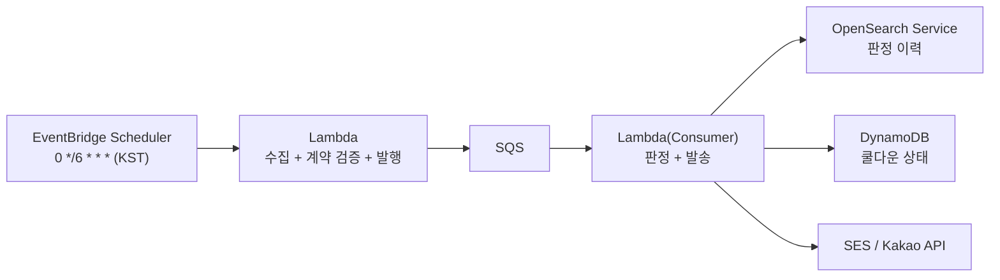

# ADR-0005. AWS 이전 경로 — 지금 구성이 로컬인 이유와 옮길 때의 모양

- 상태: 채택 (2026-07-30)
- 관련 이슈: [#52](https://github.com/hyeongyu-data/air-quality-project/issues/52)

## 맥락

현재 구성은 로컬 Docker Compose로 완결된다. 이것은 비용 절약이 아니라 **검증 가능성의 선택**이다 — 이 저장소의 모든 코드는 `docker compose up`으로 제3자가 재현·검증할 수 있어야 한다는 원칙을 지켜 왔다(검증 불가능한 AWS 코드를 지운 결정은 ADR-0001).

그래서 AWS 이전은 "코드"가 아니라 "결정 기록"으로 남긴다. 이전을 실행하는 시점에 이 문서가 출발점이 된다.

## 이전 형태

구성 요소별 대응과 근거:

| 로컬 | AWS | 근거 |
| --- | --- | --- |
| Airflow (선형 4태스크) | **EventBridge Scheduler + Lambda** | DAG가 선형이라 오케스트레이터가 하는 일이 cron뿐이다. 태스크 의존이 복잡해지면 그때 MWAA/Step Functions |
| Kafka | **SQS** | ADR-0002의 결론 그대로 — 격리·재처리는 SQS가 더 싸게 준다. 학습 목적이 끝난 운영 환경에서는 Kafka를 고집할 이유가 없다 |
| OpenSearch (이력) | OpenSearch Service | 그대로 |
| OpenSearch (쿨다운 상태) | **DynamoDB** | ADR-0003의 재검토 조건 그대로 — 지역별 KV 1건에 검색 엔진은 과하다 |
| 로컬 파일 (카카오 토큰·시그니처 캐시) | Secrets Manager / DynamoDB | 컨테이너 로컬 파일은 Lambda에서 성립하지 않는다 |

## 이전 시 반드시 밟아야 하는 지뢰 (이 저장소에서 이미 확인된 것)

1. **타임존** — 모든 시각 로직이 `timeutil.now_kst()`로 KST를 명시한다(#39). Lambda는 UTC 기본이지만 코드가 TZ에 의존하지 않으므로 안전하다. **EventBridge cron만 KST 기준으로 환산해서 등록하면 된다** (UTC 15·21·03·09시).
2. **멱등성** — `event_id`는 스케줄 슬롯 기반이라(#41) Lambda 재시도에도 유지된다. SQS 중복 배달은 기존 upsert가 흡수한다.
3. **시크릿 마스킹** — 로그 마스킹(#38)은 CloudWatch Logs에서도 그대로 유효하다.
4. **IaC 없이는 옮기지 않는다** — ADR-0001의 교훈. 콘솔 수작업으로 만든 자원은 재현 불가능한 코드와 같다. Terraform/CDK 정의가 이전 작업의 첫 커밋이어야 한다.

## 재검토 조건 (이전을 실행하는 트리거)

- 알림을 실사용자에게 상시 제공해야 해서 로컬 머신 가동이 병목이 될 때
- 지역 확장으로 수집량이 로컬 단일 브로커·단일 노드 구성의 의미를 넘어설 때

둘 다 아니면 로컬 완결 구성을 유지한다.
