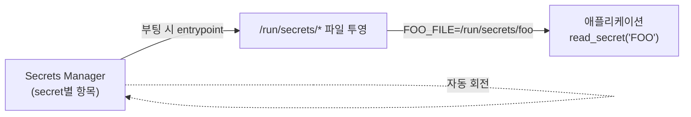

# ADR-0006. 시크릿 관리 — 로컬은 Docker secrets, 클라우드는 Secrets Manager

- 상태: 채택 (2026-09-11)
- 관련 이슈: [#117](https://github.com/hyeongyu-data/air-quality-project/issues/117)
- 관련: [ADR-0001](0001-remove-sensor-log-medallion.md)(검증 불가능한 코드는 안 넣는다), [ADR-0005](0005-aws-migration-path.md)

## 맥락

시크릿(공공 API 키, SMTP 앱 비밀번호, Slack Webhook, 카카오 토큰, Airflow
Fernet 키, 관리자 비밀번호)이 `.env` 평문 한 파일에 모여 있고, `consumer`
서비스는 `env_file: .env`로 그 전부를 컨테이너 환경변수로 주입했다. 결과:

- `docker inspect pj-consumer`, `/proc/1/environ`, `ps`에서 평문 노출
- `.env` 파일 하나 유출 = 외부 채널 + 공공 API + 암호화 키 전부 노출
- 재현 가능한 배포·감사 로그 관점에서도 부적합

`docker-compose.prod.yaml`(#20)은 `${VAR:?}`로 필수화만 했을 뿐 여전히 `.env`에서
읽었다.

## 결정

**런타임 중립적인 `_FILE` 관례를 단일 인터페이스로 삼는다.** 애플리케이션은
`read_secret("FOO")` — `FOO_FILE`이 있으면 그 파일 내용, 없으면 `FOO` 환경변수 —
만 안다. 시크릿이 파일에 어떻게 도착하는지는 배포 환경이 정한다.

| 환경 | 시크릿 → 파일 |
| --- | --- |
| 로컬 dev | `.env` 평문 (학습 편의, `_FILE` 없음 → env 폴백) |
| 로컬/셀프호스트 운영 | **Docker secrets** — `./secrets/*` → `/run/secrets/*`, `*_FILE`이 경로를 가리킴 |
| 클라우드 | **AWS Secrets Manager / SSM Parameter Store** — 부팅 시 파일로 투영 후 같은 `_FILE` 관례 |

postgres·mysql 공식 이미지가 쓰는 관례라 낯설지 않고, `docker inspect`에는
값이 아니라 **경로만** 남는다.

### 클라우드 연동 설계 (실행 시점의 출발점)

ADR-0001 원칙 — 검증 불가능한 코드는 저장소에 넣지 않는다 — 을 따라 여기서는
설계만 기록한다.

- **투영**: 컨테이너 entrypoint(또는 사이드카)가 `aws secretsmanager
  get-secret-value`로 필요한 항목만 받아 `/run/secrets/<이름>`에 쓴다. 앱 코드는
  그대로 — `_FILE` 관례가 Docker secrets와 동일하다.
- **최소 권한**: 태스크 역할(ECS) 또는 IRSA(EKS)에 secret별
  `secretsmanager:GetSecretValue`만. 와일드카드 금지.
- **회전**: Secrets Manager 자동 회전 스케줄 + 앱은 파일 재읽기. 현재 구현은
  재읽기 없이 **재시작**으로 반영한다(단일 Consumer·매시간 재시작이라 허용).
  상시 무중단이 필요해지면 파일 watch 추가.
- **노출 최소화**: 로그·예외 마스킹은 `producer/masking.py`(#38)가 이미 처리.
  새 시크릿 종류가 생기면 `_RULES`에 패턴 + `tests/test_masking.py`에 회귀.

## 대안과 기각 이유

| 대안 | 기각 이유 |
| --- | --- |
| 앱에 boto3로 Secrets Manager 직접 조회 | 로컬·테스트에서 AWS 의존/모킹 필요. `_FILE` 관례는 런타임 중립적이고 dev에서 파일만 놓으면 된다 |
| HashiCorp Vault | 별도 서버 운영. 이 규모(단일 호스트/소규모 클라우드)에 과하다 |
| SOPS / git-crypt / sealed-secrets | 암호화된 시크릿을 저장소에 커밋하는 모델. 키 관리 부담을 옮길 뿐이고 감사에 불리 |
| `.env` 유지 + 권한만 강화 | `env_file` 주입이 `docker inspect`로 새는 문제를 못 막는다 |

## 이번 이슈의 범위와 경계

- **대상**: `consumer` 서비스의 시크릿 전부(SMTP·Slack·카카오·OpenSearch
  비밀번호), Airflow compose 레벨 시크릿(Fernet·admin 비밀번호).
- **경계**:
  - Airflow가 읽는 앱 시크릿(공공 API 키·Slack 콜백)은 `.env` 바인드 마운트
    유지. `docker inspect`엔 안 뜨고, secret 매니저 이관은 #119/#120(배포 구조
    개편)에서 entrypoint와 함께.
  - Kafka UI 비밀번호는 Spring Boot가 `_FILE`을 네이티브 지원하지 않아 `.env`
    환경변수 유지. 127.0.0.1 전용이라 위험도 낮음.
  - Fernet 키 **회전**(기존 암호화 값 재암호화)은 별도 절차 — #119와 함께.
  - OpenSearch 정식 인증서·`internal_users`는 #118.

## 재검토 조건

- 클라우드 배포를 실제로 실행할 때 → 위 "클라우드 연동 설계"를 코드로.
- 시크릿 종류가 크게 늘거나 팀이 커져 중앙 관리·감사가 필요할 때 → Vault 재검토.
