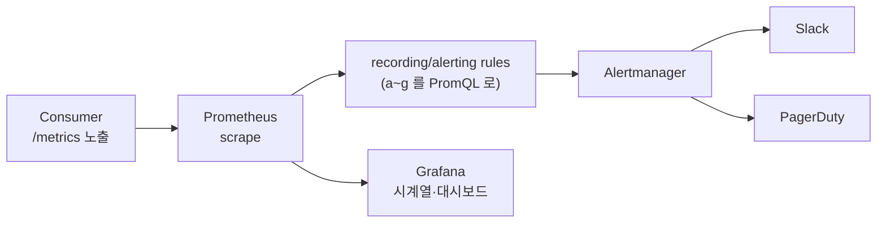

# 관측성

무엇이 보이고, 무엇이 울리는가. 측정값의 원천은 두 가지입니다 — Consumer가 OpenSearch에 남기는 **메트릭 문서**(`weather-metrics-*`)와 **구조화 로그**(`LOG_FORMAT=json`).

## 메트릭 문서 (`weather-metrics-*`, 메시지당 1건)

| 필드 | 의미 |
| --- | --- |
| `event_id` | 상관관계 ID — 발행·처리·이력·로그를 한 ID로 잇는다 |
| `e2e_latency_seconds` | 발행 타임스탬프 → 처리 완료 |
| `process_duration_ms` | 판정 + 저장 + 발송 소요 |
| `external_attempted` / `delivered_channels` | 발송 시도 여부와 실제 전달된 채널 |
| `delivery_failed` | **시도했는데 전 채널 실패** — 억제(suppressed)와 구분된다 |
| `suppressed` | 쿨다운·근거 부족으로 발송 생략 |
| `missing_indices` / `missing_count` | 결측('정보없음')이었던 지수 |
| `alert_severity` | LOW / MEDIUM / HIGH / CRITICAL |
| `opensearch_indexed` | 이력 색인 성공 여부 |

보존 90일(ISM), 월 단위 인덱스, 색인은 best-effort — 메트릭 실패가 알림 처리를 막지 않습니다.

## 구조화 로그

- Consumer는 `LOG_FORMAT=json`으로 한 줄 JSON을 남깁니다. 메시지 처리 중의 모든 로그에 `event_id`가 자동으로 붙습니다(contextvar).
- Producer(Airflow 태스크 로그)는 API 호출마다 `api_call api=<이름> status=<코드> duration_ms=<n>`을 남깁니다. 수집기 없이 grep으로 API별 응답시간·실패율을 셀 수 있습니다.

```bash
# 채널별 전달 실패 최근 10건
curl -s "localhost:9200/weather-metrics-*/_search?q=delivery_failed:true&size=10&sort=timestamp:desc"

# API별 호출 소요 (Airflow 로그에서)
docker compose exec airflow sh -c "grep -h api_call /opt/airflow/logs -r" | tail -20
```

## 시각화 — OpenSearch Dashboards

상시 필요하진 않아 `ops` 프로필로 분리돼 있습니다.

```bash
docker compose --profile ops up -d      # http://localhost:5601
./scripts/setup_dashboards.sh           # 인덱스 패턴 3종 생성(멱등)
```

도구 선택 근거 — **Grafana가 아니라 OpenSearch Dashboards**인 이유: 데이터가 이미 OpenSearch에 있어 데이터소스 설정·쿼리 변환 없이 바로 보이고, 이미지 버전을 본체(2.8.0)와 맞춰 호환성 변수를 없앱니다. 관리 UI 접근 제어는 로컬 개발 한정으로 보안 플러그인을 끈 상태이며, 운영 인증은 #20에서 다룹니다.

Discover에서 자주 쓰는 필터:

| 보고 싶은 것 | 인덱스 패턴 | 필터 |
| --- | --- | --- |
| 전달 실패 | `weather-metrics-*` | `delivery_failed: true` |
| 결측 발생 | `weather-metrics-*` | `missing_count > 0` |
| 억제(쿨다운) 비율 | `weather-metrics-*` | `suppressed: true` |
| 등급별 알림 이력 | `weather-alert-*` | `alert_severity: HIGH` 등 |
| 쿨다운 현재 상태 | `weather-cooldown-state` | — (지역당 1문서) |

Kafka 토픽·랙 확인은 기존 Kafka UI(8081)를 그대로 씁니다.

## 알람 기준

판정 쿼리는 전부 위 메트릭 문서로 계산됩니다. 여기는 **기준의 단일 출처**이고,
자동 발송은 아래 "자동 발송 (#121)"이 담당합니다.

| # | 조건 | 판정 | 배선 | 의미 |
| --- | --- | --- | --- | --- |
| a | 신규 이력 없음 | `weather-alert-*/_count` `timestamp >= now-7h` = 0 (event-time) | `alert_watch.py` | 파이프라인 정지 (6시간 주기 + 1시간 여유) |
| b | 전달 실패 | `weather-metrics-*` `delivery_failed:true` (최근 lookback) | `alert_watch.py` | 채널 인증 만료 등 — [트러블슈팅 3편](troubleshooting.md) |
| c | 결측 발생 | `weather-metrics-*` `missing_count > 0` | `alert_watch.py` | API 부분 장애. `missing_indices`로 특정 |
| d | 컨슈머 랙 | `weather-alert-group` 파티션별 (end − committed) 최댓값 > 4 | `alert_watch.py` | 소비가 발행을 못 따라감 |
| e | DAG 실패 | Airflow 실패 콜백(Slack) | #35 | 수집·발행 실패 |
| f | 디스크 | `df -P .` 사용률 ≥ 임계 | `check_storage_health.sh` (#112) | 볼륨 정리 필요 |
| g | 클러스터 red | `_cluster/health` status | `alert_watch.py` + `check_storage_health.sh` | 데이터 인덱스 replica 0 — red = 실제 장애 |
| h | 카카오 토큰 만료 임박 | Consumer 경고 로그(`만료 임박`) | #50 | 사전 재발급 |

## 자동 발송 (#121)

a·b·c·d·g 는 `consumer/alert_watch.py` 가 평가한다 — Consumer 이미지에 포함돼
`read_secret`·TLS/CA·`weather_writer` 계정을 그대로 재사용한다. f·g 는
`scripts/check_storage_health.sh` 가 호스트에서 잰다(컨테이너 안 `df` 는 VM 디스크라
호스트 압박을 못 잼). e·h 는 이미 배선.

**cron** (호스트, 저장소 루트에서). **운영 프로필은 오버레이를 함께 걸어야 한다** —
안 걸면 base compose 로 붙어(평문 `opensearch:9200`, `.env`, `weather_writer` 없음)
`collect()` 가 실패하고(rc 2) `ALERT_WATCH_SLACK_ENABLED`(`.env.prod`)도 안 읽힌다.

```cron
# 운영 (docker-compose.prod.yaml 오버레이)
COMPOSE_FILE=docker-compose.yaml:docker-compose.prod.yaml
KAFKA_UI_PASSWORD=...   # 오버레이 보간용 (compose 가 요구)
*/15 * * * *  cd /path/to/repo && flock -n /tmp/aq-alert.lock docker compose run --rm --no-deps -T consumer python consumer/alert_watch.py >> /var/log/aq-alert.log 2>&1
*/15 * * * *  cd /path/to/repo && OPENSEARCH_HEALTH_URL='https://localhost:9200/_cluster/health?wait_for_status=yellow&timeout=5s' scripts/check_storage_health.sh >> /var/log/aq-storage.log 2>&1

# 개발 (base compose)
# */15 * * * *  cd /path/to/repo && flock -n /tmp/aq-alert.lock docker compose run --rm --no-deps -T consumer python consumer/alert_watch.py >> /var/log/aq-alert.log 2>&1
```

- `run --rm` 이지 `exec` 가 아니다 — Consumer 가 죽어 있어도 돌아야 하고(그 자체가
  조건 a·d), `exec` 는 "컨테이너 다운" 과 "알람 발화" 를 exit code 로 못 가른다.
- `flock -n` 으로 겹침 방지. `run --rm` 은 프로세스가 SIGKILL 되면 멈춘 컨테이너를
  남길 수 있으니 가끔 `docker compose rm -f` 로 정리한다.
- 운영에서 `check_storage_health.sh` 의 `OPENSEARCH_HEALTH_URL` 을 https 로 덮지
  않으면 TLS 때문에 g 오탐이 15분마다 뜬다.

**환경변수** (`.env` / `.env.prod`):

| 변수 | 기본 | 뜻 |
| --- | --- | --- |
| `ALERT_WATCH_SLACK_ENABLED` | `false` | `true` 여야 실제 Slack 발송. 아니면 로그만(dry-run) |
| `SLACK_WEBHOOK_URL` | — | 기존 항목 재사용 |
| `ALERT_WATCH_LOOKBACK_MINUTES` | `70` | b·c 를 볼 최근 창 |
| `ALERT_WATCH_COOLDOWN_MINUTES` | `60` | 같은 조건 재발송 억제 |
| `ALERT_WATCH_LAG_THRESHOLD` | `4` | d 임계 |
| `ALERT_WATCH_NO_HISTORY_HOURS` | `7` | a 창 |
| `DISK_USAGE_THRESHOLD` | `80` | f 임계 (`check_storage_health.sh`) |

exit code: `0` 이상 없음 / `1` 하나 이상 발화(쿨다운 억제 포함) / `2` 수집 실패.
Slack 메시지는 `event_id`·`region`·`missing_indices`·`missing_count`·수치·
`cluster_status` 만 담는다(문서 `_source` 원문·자유 텍스트 금지).

**쿨다운 한계**: 조건별 마지막 발송 시각만 본다. 장애가 지속되면 쿨다운
간격(기본 60분)마다 다시 울린다 — 조용해지지 않는다. "N회 이후 에스컬레이션"은
범위 밖.

## 확장 인터페이스 (설계)

현재는 Slack 단일 receiver. 스택을 키울 때의 형태를 기록한다 — 실제 배선은 별도.

### Prometheus / Grafana / Alertmanager



- Consumer 가 `weather-metrics-*` 색인 **대신(또는 추가로)** `/metrics`(prometheus_client)
  를 노출 → `e2e_latency_seconds`·`process_duration_ms` 는 히스토그램, `delivery_failed`·
  `missing_count` 는 카운터.
- a~g 를 PromQL alerting rule 로: 예) `a` = `absent_over_time(weather_alert_indexed_total[7h])`.
- Alertmanager receiver 가 Slack/PagerDuty 로 라우팅, `severity` 라벨로 분기.
- **재검토 조건**: 시계열 대시보드·다중 receiver·라우팅 규칙이 실제로 필요해질 때.

### PagerDuty / Opsgenie

- Slack webhook 대신(또는 `alert_severity=CRITICAL` 만) Events API v2 로 incident 생성.
- `alert_watch.py` 의 `notify()` 에 receiver 추상화 지점을 둔다(현재는 `_post_slack` 하나).
- 온콜 로테이션·에스컬레이션 정책은 팀 운영 정책 결정 후 — 범위 밖.

## 실측 수치 (2026-07-30, 로컬 Docker)

| 항목 | 값 |
| --- | --- |
| end-to-end 지연 (발행→처리 완료) | **16.3초** — 폴링 간격(10초)이 지배. 판정 자체가 아니라 대기 시간 |
| 메시지 처리 소요 | **100.6 ms** (판정 + 이력 색인 + 발송 시도) |
| API 호출 소요 | Airflow 로그의 `api_call duration_ms` — 공공 API별 수백 ms~수 초 |
| 처리량 상한 | 초당 ~1건 (10초 폴링 × 배치 10) — 하루 4건 워크로드 기준 충분 |

같은 실측에서 알람 (b)·(c)의 판정 필드도 실제 상황으로 확인됐습니다 — 만료된 카카오 토큰으로 `delivery_failed: true`, `yellow_dust: null` 입력으로 `missing_indices: ["dust"]`.

수치는 메트릭 문서에서 직접 다시 잴 수 있습니다:

```bash
curl -s "localhost:9200/weather-metrics-*/_search" -H 'Content-Type: application/json' -d '{
  "size": 0,
  "aggs": {
    "e2e": {"stats": {"field": "e2e_latency_seconds"}},
    "duration": {"stats": {"field": "process_duration_ms"}}
  }
}'
```

### p50/p95 재측정

최근 24시간 메트릭에서 처리 소요와 end-to-end 지연의 p50·p95를 조회합니다.
운영 보고서에는 조회 기간과 Consumer 설정을 함께 기록합니다.

```bash
curl -s "localhost:9200/weather-metrics-*/_search" \
  -H 'Content-Type: application/json' \
  -d '{"size":0,"query":{"range":{"timestamp":{"gte":"now-24h"}}},"aggs":{"e2e_percentiles":{"percentiles":{"field":"e2e_latency_seconds","percents":[50,95]}},"process_percentiles":{"percentiles":{"field":"process_duration_ms","percents":[50,95]}}}}'
```

기본 구성의 이론상 처리량 상한은 `max_poll_records=10`과 10초 폴링 간격으로
초당 약 1건입니다. 실제 용량 계획과 장애 기준은 위 쿼리의 p95를 기준으로
갱신합니다.
